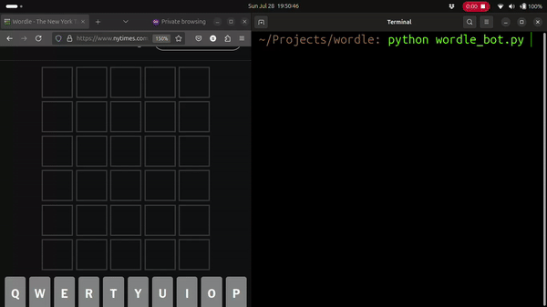

# Wordle Bot

A Python bot to that employs information theory to solve Wordle puzzles efficiently.

Wordle is a daily online word puzzle where players have six attempts to guess a five-letter word. After each guess, the color of the tiles changes to indicate whether the letter is correct, in the wrong position, or not in the word at all. The game's simplicity, coupled with the daily challenge and social aspect of sharing results, has made it a global phenomenon.

## Demo



## Usage

When you run the bot for the first time, it will give you five words which will give you the most information according to its calculations. You can choose any of those words to start the game with. After that, you enter the word chose and the pattern you got.

```cmd
Enter the guess:
Enter the pattern:
```

By default, you can enter in capital or small letters. The pattern should be shown like this: black `b` for grey box, `y` for yellow box, and `g` for green box without spaces. For example: `bbgbb` is valid pattern. After you enter this, it will give you the next five most efficient guesses, and show how many possible solutions are remaining.

## How it works

At the beginning of the game, any word can be the answer. We don't put the guess by guessing what can the answer be, but by guessing what word can limit our space of possible solutions. The way I go about this is inspired from 3b1b.

For every guess, the output would be one of `243` patterns possible. Assuming every word has the equal probability of being the solution, the most likely pattern is the one which correspond to maximum number of words. So, this creates a probability distribution of patterns among the guesses. Our best guess would be the one which creates the most number of patterns. 

Eevery word, compared with every other word will make a matching pattern (eg ` bbgbb` something like that), we will compute the number of words for each pattern. Since the probablity of each word is the same, the probablity of the patterns will be just the number of words.We will compute information from here. 

The information of a perticular word is related to probablity of pattern it can make with the correct guees (hidden word). This will be calculated by the formula:

$$I(w) = -\sum_{i=0}^{i=N} p_i \log p_i$$

where $N$ is the number of patterns of p is the probability of the pattern. We will select the word which gives us the maximum information. 

When we put that word with max information in the game, we will get some pattern as a result. We will only select the words with same pattern. And then play the game with limited number of words, until we find our answer. (Or be out of guess). 

I know I have explained poorly here. But you can check out [3b1b's vide](https://www.youtube.com/watch?v=v68zYyaEmEA) for more clarity: 

## Installation

Okay, you will need two libraries to run this. `numpy` and `pandas`. After that you can follow the simple process.

Install Numpy and andas

```cmd
 pip install numpy, pandas
 ```

Clone the project

 ```cmd
 git clone
 ```

Run the bot

```cmd
python wordle_bot.py
```

## Contributing

Contributions are always welcome!
Please adhere to this project's `code of conduct`.

## License

[MIT](https://github.com/iashyam/wordle-bot/blob/main/LICENSE)
Copyright Shyam Sunder &copy; 2024
